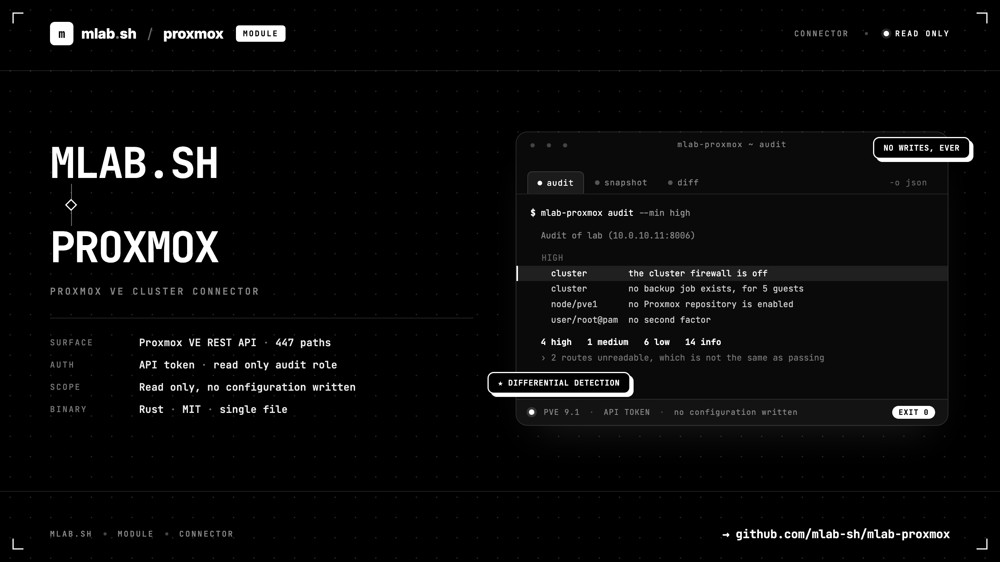

# mlab-proxmox



**A CLI over the Proxmox VE REST API, built as a base for passive
infrastructure security work.**

It talks to any node of a cluster over `https://<host>:8006/api2/json`, with an
API token in one header, and a profile in `$HOME/.mlab/proxmox.conf` says which
cluster to reach and how.

It reads. Nothing in this tool changes a configuration, no wrapped command
issues anything but a GET, and no data leaves your machine.

Requires Proxmox VE 7.x or later. Tested against 9.1.

## Install

**Homebrew** (macOS and Linux)

```bash
brew tap mlab-sh/mlab-proxmox https://github.com/mlab-sh/mlab-proxmox.git
brew install mlab-proxmox
```

**Debian and Ubuntu**: download the `.deb` for your architecture from the
[releases page](https://github.com/mlab-sh/mlab-proxmox/releases), then:

```bash
sudo apt install ./mlab-proxmox_1.0.0_amd64.deb
```

**Fedora, RHEL and rebuilds**: the same with the `.rpm`:

```bash
sudo dnf install ./mlab-proxmox-1.0.0-1.x86_64.rpm
```

**Prebuilt binary** (macOS and Linux, x86_64 and arm64): a tarball from the same
page. The Linux builds are linked against glibc 2.35, so Debian 12 and Ubuntu
22.04 and newer.

Every release carries a `SHA256SUMS` file covering all of its assets:

```bash
sha256sum -c --ignore-missing SHA256SUMS
```

**From source** (a recent Rust toolchain):

```bash
git clone https://github.com/mlab-sh/mlab-proxmox.git
cd mlab-proxmox && cargo build --release
```

See [Install](wiki/Install.md) for the details, and
[Releasing](wiki/Releasing.md) for how these packages are built.

## First run

Create a read-only role and a token on the cluster — four commands, see
[Token](wiki/Token.md) for what each one does:

```bash
pveum role add MlabAudit --privs "Sys.Audit,Sys.Syslog,VM.Audit,VM.GuestAgent.Audit,Datastore.Audit,SDN.Audit,Pool.Audit,Mapping.Audit"
pveum user add mlab@pve && pveum acl modify / --user mlab@pve --role MlabAudit && pveum user token add mlab@pve audit --privsep 0
```

The secret is printed once. Then:

```bash
mlab-proxmox login --name lab --host 10.0.10.11 --token-id 'mlab@pve!audit'
mlab-proxmox ping
mlab-proxmox whoami
mlab-proxmox audit
```

`login` prompts for the secret without echoing it, checks the connection,
records the certificate fingerprint, and writes the config file 0600 in a 0700
directory.

## Commands

| Command | What it does |
| --- | --- |
| [`audit`](wiki/Audit.md) | Every graded check in one report. Start here. |
| [`snapshot`](wiki/Snapshot.md) | One dated, secret-free record of everything the token can read. |
| [`diff`](wiki/Diff.md) | What changed between two snapshots. |
| [`shadow`](wiki/Shadow.md) | What turned up since the last snapshot. |
| [`login`](wiki/Login.md) | Create or update a profile, prove the token works, save it. |
| [`ping`](wiki/Ping.md) | Check that the current profile reaches its cluster. |
| [`whoami`](wiki/Whoami.md) | What this token is, and everything it is allowed to read. |
| [`nodes`](wiki/Nodes.md) | The hosts: hardware, services, certificates, disks. |
| [`guests`](wiki/Guests.md) | The virtual machines and containers, and their hardening. |
| [`storage`](wiki/Storage.md) | What the cluster stores things on. |
| [`access`](wiki/Access.md) | Users, tokens, roles and the access control list. |
| [`firewall`](wiki/Firewall.md) | The four levels, and whether they agree with each other. |
| [`backup`](wiki/Backup.md) | Coverage, jobs, history. |
| [`patch`](wiki/Patch.md) | Repositories, subscription, pending updates. |
| [`posture`](wiki/Posture.md) | The cluster-wide settings that claim to defend something. |
| [`footprint`](wiki/Footprint.md) | What this cluster looks like from outside. |
| [`blast`](wiki/Blast.md) | What one compromised guest reaches. |
| [`tasks`](wiki/Tasks.md) | Who did what, and whether it worked. |
| [`logins`](wiki/Logins.md) | Who authenticated, who failed, and from where. |
| [`api`](wiki/Api.md) | Raw request against any path, for what is not wrapped yet. |
| [`profile`](wiki/Configuration.md) | List, show, select and delete saved clusters. |
| [`config`](wiki/Configuration.md) | Where the config file is, and what is in it. |

Every command renders to the terminal by default and to raw JSON with
`-o json`. See [Output](wiki/Output.md).

## Documentation

Everything lives in the **[wiki](wiki/Home.md)**, one page per command plus the
concepts they rest on:

- [Token](wiki/Token.md), the role and the API token this CLI authenticates
  with, and why a role is never attached to a token directly.
- [Surfaces](wiki/Surfaces.md), the one API a cluster answers on: 447 paths,
  the permission model, and the 34 reads a read-only token cannot reach.
- [Checks](wiki/Checks.md), the catalogue of graded findings and what each one
  means.
- [Passive security](wiki/Passive-Security.md), the defensive work this data
  supports without emitting a packet at a target.
- [Configuration](wiki/Configuration.md), profiles and the precedence between
  flags, environment and file.
- [Roadmap](wiki/Roadmap.md), what is built and what is next.
- [Releasing](wiki/Releasing.md), how a version becomes a Homebrew formula, a
  `.deb` and an `.rpm`.

The pages are written in [`wiki/`](wiki/Home.md) in this repository and mirrored
to the GitHub wiki by
[`.github/workflows/wiki-sync.yml`](.github/workflows/wiki-sync.yml) on every
push to `main` that touches them. The repository is the source of truth, so
edit the files here rather than the pages in the wiki UI, which are overwritten
on the next sync.

## Layout

```
src/
  main.rs          entry point
  cli/             the clap surface, and the context a command runs in
  commands/        one file per command
  pve/             the HTTP client, profiles
  collect.rs       one pass over everything the token can read
  checks/          the graded checks, as pure functions over collected data
  ui/              the terminal render and the progress rules
wiki/              the documentation, mirrored to the GitHub wiki
Formula/           the Homebrew formula, regenerated at every release
.github/workflows/ the wiki sync and the release pipeline
```

## Two things worth knowing before you start

**The datacenter firewall is off by default.** A cluster nobody has configured
has firewall rules, zones and a whole UI, and no packet filter. `firewall
status` is the one view that says so.

**There is no event stream.** Nothing in the Proxmox API pushes; the web
interface polls. Detection here is differential — `snapshot`, then `shadow` on
a schedule — rather than alert-driven.
